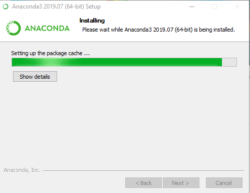

Используя google поищите "anaconda download",

Найденная ссылка приведет на сайт
[anaconda.com](https://www.anaconda.com/distribution/)

Выберите свою операционную систему и скачайте
Python версии **3.7** нажав на **Download**

По окончании загрузки запустите установочный файл.
Для операционной системы Windows это 
anaconda3-2019.07-Windows-x86_64.exe

---
Далее следуйте скриншотам

Next / Далее

I agree / Согласен

Just Me / Только для меня

Next / Далее

отметьте второй чекбокс

Show details / Подробнее

Next / Далее

по этой ссылке можно скачать IDE 

снимите отметки на чекбоксах
и нажмите Finish / Занончить

---
Для удобства можно скопировать ярлыки на рабочий стол

Их можно найти, если в меню пуск набрать несколько первых
букв anaconda

кликнуть правой кнопкой мыши и выбрать расположение файла

В моем случае ярлыки расположились тут
*C:\Users\ Имя пользователя \AppData\Roaming\Microsoft\Windows\Start Menu\Programs\Anaconda3 (64-bit)*

Скопировал на рабочий стол:
  - Jupyter Notebook (anaconda3)
  - Spyder (anaconda3)
  - Anaconda Prompt (anaconda3)

